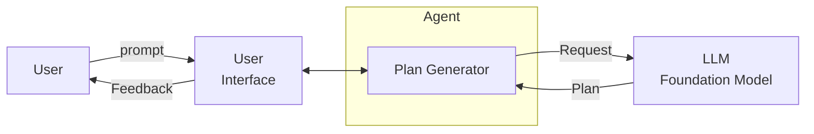

# Incremental Model Querying

**Resumo**  
O padrão **Incremental Model Querying** descreve um processo iterativo no qual o agente interage com o modelo de base várias vezes durante a geração do plano. A cada etapa, novos prompts e contextos parciais são usados para refinar o raciocínio e construir um plano mais completo e explicável.

## Contexto
Quando os usuários fornecem um objetivo ao agente, o modelo de base pode ter dificuldade para retornar um plano correto ou completo em uma única consulta. O processo de raciocínio pode exigir múltiplas etapas intermediárias, atualizações de contexto ou refinamentos.

## Problema
Como o agente pode realizar um raciocínio preciso e explicável quando uma consulta one-shot é insuficiente para gerar um plano coerente?

## Forças
- **Janela de contexto limitada** – Restrições de tokens dificultam incluir todas as informações necessárias em um único prompt.
- **Super-simplificação** – Consultas one-shot podem perder nuances e interdependências.
- **Explicabilidade** – Planos transparentes e passo a passo aumentam a confiança do usuário e facilitam a depuração.

## Solução
O agente utiliza um processo em múltiplas etapas, consultando o modelo de base em cada estágio da geração do plano. Resultados intermediários podem ser validados, ajustados ou expandidos usando feedback do usuário, memória ou saídas de ferramentas. O número de consultas pode ser pré-definido ou dinâmico, e o processo pode seguir templates reutilizáveis ou repositórios de fluxo de trabalho.

## Consequências

### Benefícios
- **Contexto suplementar** – As tarefas podem ser divididas entre vários prompts, resolvendo o problema da janela de contexto.
- **Maior certeza no raciocínio** – O refinamento iterativo aumenta a precisão dos resultados.
- **Explicabilidade** – Cada etapa pode incluir justificativas, tornando o plano mais fácil de entender.

### Desvantagens
- **Sobrecarga** – Múltiplas consultas aumentam latência e custo computacional.
- **Custo** – Alto volume de interações pode se tornar caro ao usar modelos comerciais.

## Usos Conhecidos
- **HuggingGPT** – Decompõe pedidos do usuário em sub-tarefas via múltiplas consultas a modelos.
- **EcoAssistant** – Refina iterativamente código usando loops de feedback dirigidos por LLM.
- **ReWOO** – Planeja e executa tarefas interdependentes usando observações assistidas por ferramentas.

## Padrões Relacionados
- **One-Shot Model Querying** – Alternativa direta para tarefas simples com consulta única.
- **Multi-Path Plan Generator** – Gera iterativamente planos ramificados com entrada do usuário.
- **Self-Reflection** – Consulta o modelo várias vezes para revisar e refinar saídas.
- **Human-Reflection** – Permite iteração colaborativa entre usuário e agente.
- **Multimodal Guardrails** – Atua como intermediário para interações do modelo mais seguras e estruturadas.

## Referências
[37] Shen et al., “HuggingGPT,” 2023.  
[38] Li et al., “EcoAssistant,” 2023.  
[39] Xu et al., “ReWOO: Reasoning with Workflow and Observation,” 2023.