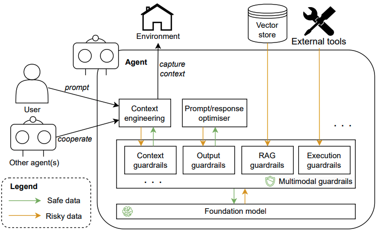

# MultimodalGuardrails Pattern

## Short Summary

**Multimodal Guardrails** control the inputs and outputs of foundation models to meet specific requirements, such as user needs, ethical standards, and legal regulations.

## Overview

The **MultimodalGuardrails** pattern defines a framework for enforcing constraints and safety rules across multiple data modalities (text, images, audio, video). It ensures that multimodal systems operate within defined boundaries, improving reliability, safety, and compliance.

## Usage Context

This pattern is relevant in systems where an agent consists of a foundation model and other components. When users provide specific goals, the underlying foundation model is consulted to achieve those goals. Multimodal Guardrails act as an intermediary to ensure safe and compliant interactions.

## Problem Statement

How can we prevent a foundation model from being influenced by adversarial inputs or from generating harmful or undesirable outputs for users and other system components?

## Forces

- **Robustness**: Adversarial information can be sent to the foundation model, affecting its memory, reasoning, and subsequent results.
- **Safety**: Foundation models may generate inappropriate responses due to hallucinations, which can offend users or disrupt other components.
- **Standards Alignment**: Agents and foundation models must comply with industry, organizational, and legal standards.

## Proposed Solution

Apply **guardrails** as an intermediate layer between the foundation model and all other system components:

- When users or components send prompts/messages to the foundation model, guardrails first check if the information meets predefined requirements. Only valid information is delivered to the model (e.g., PII is handled or removed to protect privacy).
- Guardrails can evaluate content based on predefined examples or in a reference-independent manner.
- When the foundation model generates outputs, guardrails ensure responses do not include biased or disrespectful information and meet specific requirements.
- Multiple guardrails can be implemented, each responsible for specialized interactions (e.g., data retrieval, user input validation, external API invocation).
- Guardrails are capable of processing multimodal data (text, audio, video) for comprehensive monitoring and control.

## Components

- **GuardrailManager**: Orchestrates the application of guardrails for each modality.
- **TextGuardrail**: Handles rules and constraints for text data.
- **ImageGuardrail**: Handles rules and constraints for image data.
- **AudioGuardrail**: Handles rules and constraints for audio data.
- **PolicyStore**: Stores and manages guardrail policies and configurations.
- **ViolationReporter**: Collects and reports violations detected by guardrails.

## Workflow

1. Input data (text, image, audio, video) is received by the system.
2. The `GuardrailManager` dispatches the data to the appropriate guardrail component(s).
3. Each guardrail applies its rules and checks for violations.
4. If a violation is detected, the `ViolationReporter` logs or acts on the event.
5. Only data that passes all relevant guardrails proceeds to downstream processing.

## Consequences

### Benefits

- **Robustness**: Filters out inappropriate contextual information, preserving model reliability.
- **Safety**: Validates model outputs, ensuring user safety.
- **Standards Alignment**: Configurable to organizational policies, ethical standards, and legal requirements.
- **Adaptability**: Can be implemented across various models and agents, with customizable requirements.

### Drawbacks

- **Overhead**: Collecting a diverse, high-quality corpus for multimodal guardrails and real-time processing can increase computational requirements and costs.
- **Lack of Explainability**: The complexity of multimodal guardrails can make it difficult to explain final outputs.

## Real-World Examples

- **NeMo Guardrails (NVIDIA)**: Ensures dialogue coherence and prevents negative impacts from misinformation and sensitive topics.
- **Llama Guard (Meta)**: Foundation model-based safeguard, trained on a risk taxonomy to identify potentially risky or violating content in prompts and outputs.
- **Guardrails AI**: Provides a hub listing various validators for handling different risks in foundation model inputs and outputs.

## Relationship to Other Patterns

- **Proactive Goal Creator**: Multimodal Guardrails can process multimodal data captured by this pattern.
- **One-shot and Incremental Model Querying**: Multimodal Guardrails serve as an intermediary layer, managing inputs and outputs for model queries.

## Use Cases

- Preventing unsafe or non-compliant content in multimodal AI systems.
- Enforcing copyright, privacy, or ethical guidelines across data types.
- Modular extension to support new modalities or updated policies.

## Integration

- Implement guardrail interfaces for each modality as needed.
- Configure the `PolicyStore` with organization-specific rules.
- Integrate the `GuardrailManager` into the multimodal data pipeline.

## Future Work

- Define detailed guardrail policies for each modality.
- Provide implementation examples and code snippets.
- Add class and sequence diagrams to illustrate component interactions.

---