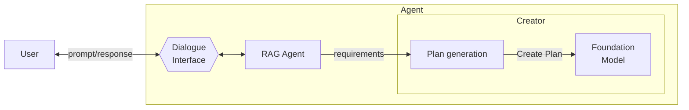

# One-Shot Model Querying

**Summary**  
The **One-Shot Model Querying** pattern describes a direct interaction in which the agent queries a foundation model (LLM) **only once** to generate a complete plan based on a user’s input. This approach favors simplicity and efficiency, making it suitable for straightforward tasks that can be handled in a single reasoning step.

## Context
When users request help from agents to accomplish goals, the agent may need to generate an action plan. In some scenarios, the task is clearly defined and self-contained, allowing the agent to query the LLM once and use the response as-is.

## Problem
How can the agent efficiently generate a complete and useful plan from a user-defined goal, minimizing latency and cost while maintaining a simple architecture?

## Forces
- **Efficiency** – Some use cases demand low-latency responses.
- **Cost** – Querying commercial foundation models often incurs cost.
- **Context stability** – The entire task context is already known at the time of query.

## Solution
The agent constructs a prompt from the user’s goal and sends it **only once** to the LLM. The returned response contains the full plan or output needed to satisfy the goal. There is no follow-up prompt, refinement, or validation step.

## Consequences

### Benefits
- **High performance** – Plans are generated quickly and deterministically.
- **Cost-effective** – Requires only a single model invocation.
- **Simple architecture** – No need for memory, retrievers, or iterative loops.

### Drawbacks
- **Oversimplification** – May fail to address complex or nuanced tasks.
- **Limited explainability** – The model’s reasoning steps are implicit.
- **Context window constraints** – Token limits may prevent detailed output.

## Known Uses
- **Single-step plan generation** based on clear goals.
- **Zero-shot and Chain-of-Thought prompting** used in one turn.
- **Instant assistants** for summarization, idea generation, or basic planning.

## Related Patterns
- **Incremental Model Querying** – Iterative version of this pattern, with verification and refinement.
- **Single-Path Plan Generator** – Uses a one-shot output to define a linear plan.
- **Multimodal Guardrails** – Can wrap or monitor the single interaction for reliability.

## References
[35] Kojima et al., “Large Language Models are Zero-Shot Reasoners,” 2022.  
[36] Wei et al., “Chain-of-Thought Prompting Elicits Reasoning in LLMs,” 2022.  
[13] LinkedIn Engineering, “Musings on Building a Generative AI Product,” 2023.