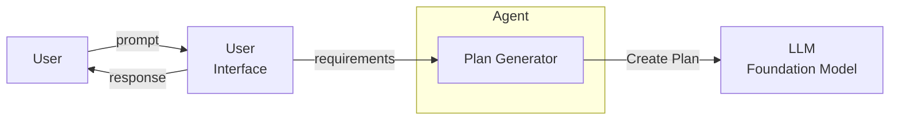

# One-Shot Model Querying

**Resumo**  
O **One-Shot Model Querying** descreve uma interação direta na qual o agente consulta um modelo de base (LLM) **apenas uma vez** para gerar um plano completo com base na entrada do usuário. Essa abordagem favorece simplicidade e eficiência, tornando-a adequada para tarefas diretas que podem ser tratadas em um único passo de raciocínio.

```mermaid
flowchart LR
    U[User] -->|prompt| Dlg[User <br> Interface]
    Dlg -->|response| U
    subgraph Agent
        PG[Plan Generator]
    end
    PG --> |Create Plan| LLMa[LLM <br>Foundation Model]
    Dlg -->|requirements| PG
```

## Contexto
Quando os usuários solicitam ajuda aos agentes para alcançar objetivos, o agente pode precisar gerar um plano de ação. Em alguns cenários, a tarefa é claramente definida e autocontida, permitindo que o agente consulte o LLM uma vez e use a resposta tal como está.

## Problema
Como o agente pode gerar de forma eficiente um plano completo e útil a partir de um objetivo definido pelo usuário, minimizando latência e custo enquanto mantém uma arquitetura simples?

## Forças
- **Eficiência** – Alguns casos de uso exigem respostas de baixa latência.
- **Custo** – Consultar modelos de base comerciais frequentemente gera custos.
- **Estabilidade do contexto** – Todo o contexto da tarefa já é conhecido no momento da consulta.

## Solução
O agente constrói um prompt a partir do objetivo do usuário e o envia **apenas uma vez** ao LLM. A resposta retornada contém o plano completo ou a saída necessária para satisfazer o objetivo. Não há etapa de acompanhamento, refinamento ou validação.

## Consequências

### Benefícios
- **Alto desempenho** – Planos são gerados rapidamente e de forma determinística.
- **Custo-efetivo** – Requer apenas uma invocação do modelo.
- **Arquitetura simples** – Não há necessidade de memória, mecanismos de recuperação ou loops iterativos.

### Desvantagens
- **Simplificação excessiva** – Pode falhar em tarefas complexas ou nuançadas.
- **Explicabilidade limitada** – Os passos de raciocínio do modelo são implícitos.
- **Limitações da janela de contexto** – Limites de tokens podem impedir uma saída detalhada.

## Usos Conhecidos
- **Geração de plano em um único passo** baseada em objetivos claros.
- **Zero-shot e Chain-of-Thought** utilizados em uma única interação.
- **Assistentes instantâneos** para sumarização, geração de ideias ou planejamento básico.

## Padrões Relacionados
- **Incremental Model Querying** – Versão iterativa deste padrão, com verificação e refinamento.
- **Single-Path Plan Generator** – Usa uma saída one-shot para definir um plano linear.
- **Multimodal Guardrails** – Podem envolver ou monitorar a interação única para maior confiabilidade.

## Referências
[35] Kojima et al., “Large Language Models are Zero-Shot Reasoners,” 2022.  
[36] Wei et al., “Chain-of-Thought Prompting Elicits Reasoning in LLMs,” 2022.  
[13] LinkedIn Engineering, “Musings on Building a Generative AI Product,” 2023.