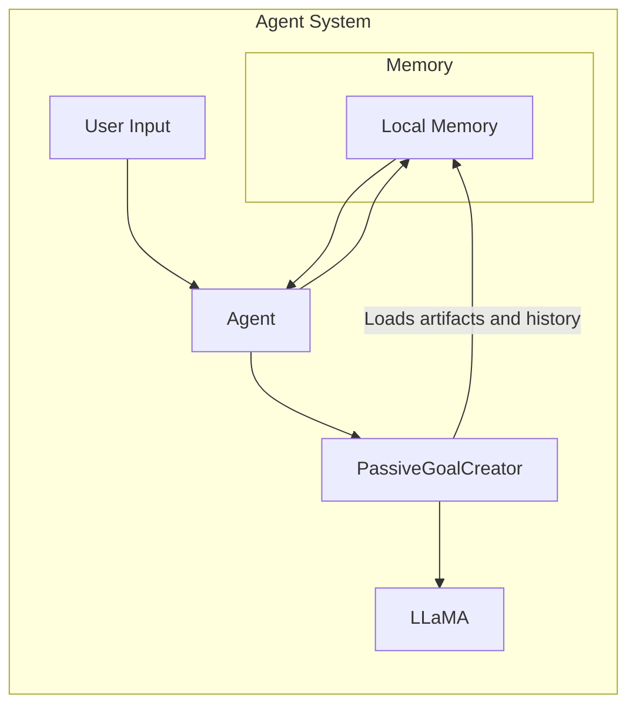

## Passive Goal Creator
The **Passive Goal Creator** analyzes user-articulated goals through a dialogue interface.

### Context
When interacting with agents to solve specific problems, users provide related context and describe their goals through prompts.

### Problem
Users may lack experience in interacting with agents, and the provided information may be ambiguous, making it difficult for agents to achieve the desired goals.

### Forces
- **Underspecification**: Users might not provide complete context or clearly defined goals.
- **Efficiency**: Agents are expected to provide quick responses.

### Solution
A foundation model-based agent provides a dialogue interface through which users directly specify the context and problems. This information is passed to the *Passive Goal Creator*, which determines the goals.

Additionally, the *Passive Goal Creator* can retrieve supplementary information from the agent’s memory, including:
- Artifact repositories;
- Tools used in recent tasks;
- Conversation history;
- Positive and negative examples.

This information is appended to the user prompt to assist in goal identification. The generated goals are then sent to other components for decomposition and task execution.

In multi-agent systems, one agent can invoke another agent’s API to delegate a task. The receiving agent analyzes the information to determine the corresponding goal.

### Consequences

#### Benefits
- **Interactivity**: Users or other agents can interact directly with the agent via dialogue interfaces or APIs.
- **Goal-seeking**: The agent can analyze user-provided context and retrieve memory data to identify and plan goal achievement.
- **Efficiency**: The dialogue interface offers a straightforward and intuitive way for users to provide input.

#### Drawbacks
- **Reasoning uncertainty**: Ambiguous context and lack of standardized prompt structures can increase uncertainty during reasoning.

### Known Use Cases
- **Liu et al. (2024)**: Agent that helps refine research questions via a dialogue interface.
- **Kannan et al. (2022)**: Agent that allows users to decompose and assign tasks to robots.
- **HuggingGPT**: Interprets complex user requests as intended goals through a chatbot interface.

### Related Patterns
- **Proactive Goal Creator**: An alternative pattern that enables multimodal context injection.
- **Prompt/Response Optimiser**: Can refine goals and context received from the *Passive Goal Creator*.