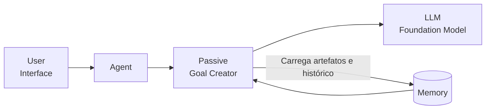

# Passive Goal Creator

O **Criador de Objetivos Passivo** analisa objetivos articulados pelo usuário através de uma interface de diálogo.


```mermaid
flowchart LR
        UI[User <br> Interface] --> AG[Agent]
        AG --> PGC[Passive <br> Goal Creator]
        PGC --> LLM[LLM <br> Foundation Model]

            MEM[(Memory)]

        MEM --> PGC
        PGC -->|Carrega artefatos e histórico| MEM
```

### Contexto
Ao interagir com agentes para resolver problemas específicos, os usuários fornecem contexto relacionado e descrevem seus objetivos por meio de prompts.

### Problema
Os usuários podem não ter experiência em interagir com agentes, e as informações fornecidas podem ser ambíguas, dificultando que os agentes alcancem os objetivos desejados.

### Forças
- **Subespecificação**: Os usuários podem não fornecer contexto completo ou objetivos claramente definidos.
- **Eficiência**: Espera-se que os agentes forneçam respostas rápidas.

### Solução
Um agente baseado em modelo fundamental fornece uma interface de diálogo pela qual os usuários especificam diretamente o contexto e os problemas. Essas informações são encaminhadas ao *Criador de Objetivos Passivo*, que determina os objetivos.

Além disso, o *Criador de Objetivos Passivo* pode recuperar informações suplementares da memória do agente, incluindo:
- repositórios de artefatos;
- ferramentas usadas em tarefas recentes;
- histórico de conversas;
- exemplos positivos e negativos.

Essas informações são anexadas ao prompt do usuário para auxiliar na identificação dos objetivos. Os objetivos gerados são então enviados para outros componentes para decomposição e execução de tarefas.

Em sistemas multiagente, um agente pode invocar a API de outro agente para delegar uma tarefa. O agente receptor analisa as informações para determinar o objetivo correspondente.

### Consequências

#### Benefícios
- **Interatividade**: Usuários ou outros agentes podem interagir diretamente com o agente via interfaces de diálogo ou APIs.
- **Busca por objetivos**: O agente pode analisar o contexto fornecido pelo usuário e recuperar dados da memória para identificar e planejar a conquista de objetivos.
- **Eficiência**: A interface de diálogo oferece uma forma direta e intuitiva para os usuários fornecerem entradas.

#### Desvantagens
- **Incerteza no raciocínio**: Contexto ambíguo e falta de estruturas de prompt padronizadas podem aumentar a incerteza durante o raciocínio.

### Casos de Uso Conhecidos
- **Liu et al. (2024)**: Agente que ajuda a refinar perguntas de pesquisa via interface de diálogo.
- **Kannan et al. (2022)**: Agente que permite aos usuários decompor e atribuir tarefas a robôs.
- **HuggingGPT**: Interpreta pedidos complexos de usuários como objetivos pretendidos através de uma interface de chatbot.

### Padrões Relacionados
- **Criador de Objetivos Proativo**: Padrão alternativo que permite injeção de contexto multimodal.
- **Otimizador de Prompt/Resposta**: Pode refinar objetivos e contexto recebidos do *Criador de Objetivos Passivo*.
```