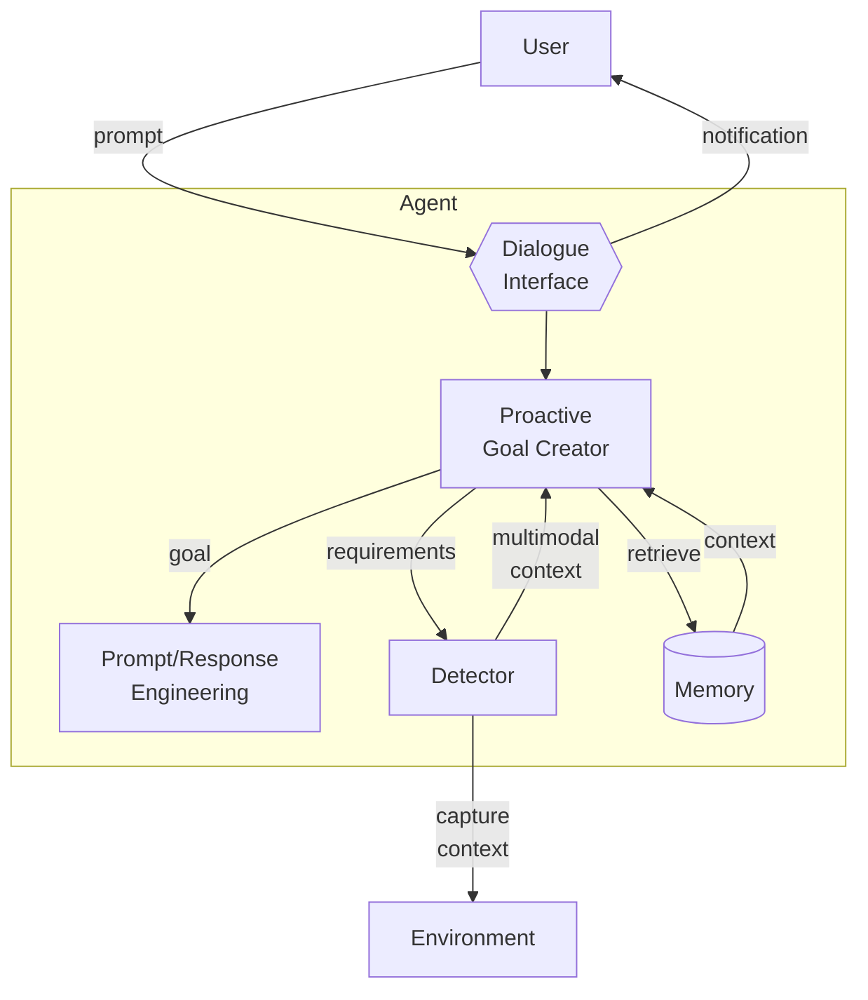

# Proactive Goal Creator

**Summary**  
The *Proactive Goal Creator* anticipates users’ goals by analysing human interactions and proactively capturing multimodal context through appropriate detectors, thereby enriching goal descriptions and improving accessibility. 2405.10467v4.pdf](file-service://file-KXAPTmJJtHAEXXJmGY3mtW)

## Context
Users usually express—through a prompt or dialogue—the goals they expect an agent to achieve. Dialogue alone, however, may provide insufficient environmental context. 2405.10467v4.pdf](file-service://file-KXAPTmJJtHAEXXJmGY3mtW)

## Problem
When an agent relies solely on text/voice conversation, the context it receives can be incomplete or ambiguous, leading to inaccurate goal inference and sub‑optimal behaviour. 2405.10467v4.pdf](file-service://file-KXAPTmJJtHAEXXJmGY3mtW)

## Forces
* **Underspecification** – (i) Users may fail to supply complete context or specify precise goals; (ii) agents can retrieve only limited context from memory. 2405.10467v4.pdf](file-service://file-KXAPTmJJtHAEXXJmGY3mtW)
* **Accessibility** – Users with certain disabilities may be unable to interact effectively through a passive, text‑only interface. 2405.10467v4.pdf](file-service://file-KXAPTmJJtHAEXXJmGY3mtW)

## Solution
In addition to the prompt and any retrieved context, the *Proactive Goal Creator* issues **requirements** to external detectors (e.g., cameras, screen‑capture APIs, microphones, sensors). These detectors capture the user’s surroundings—gestures, UI layout, location, etc.—and return multimodal data that the component analyses to infer the **real** goal. The component must proactively notify users when context capture occurs and keep false positives low to prevent unnecessary interruptions. Captured observations can be stored in memory to build evolving *world models* that improve future reasoning (see Figure 1).

## Consequences

### Benefits
* **Interactivity** – The agent can react to latent user intentions revealed by multimodal context. 2405.10467v4.pdf](file-service://file-KXAPTmJJtHAEXXJmGY3mtW)
* **Goal‑seeking accuracy** – Richer input increases goal completeness and precision. 2405.10467v4.pdf](file-service://file-KXAPTmJJtHAEXXJmGY3mtW)
* **Accessibility** – Alternative input modalities support users with visual, motor, or speech impairments. 2405.10467v4.pdf](file-service://file-KXAPTmJJtHAEXXJmGY3mtW)

### Drawbacks
* **Overhead** – Collecting and processing multimodal data introduces computational and latency costs. 2405.10467v4.pdf](file-service://file-KXAPTmJJtHAEXXJmGY3mtW)
* **Communication** – Large context payloads may increase bandwidth between client and agent. 2405.10467v4.pdf](file-service://file-KXAPTmJJtHAEXXJmGY3mtW)

## Known Uses
* **GestureGPT** – Interprets hand gestures captured by camera to derive user intents. ‡2405.10467v4.pdf](file-service://file-KXAPTmJJtHAEXXJmGY3mtW)
* **SeeHow** – Extracts coding steps and code snippets from programming screencasts. ‡2405.10467v4.pdf](file-service://file-KXAPTmJJtHAEXXJmGY3mtW)
* **ProAgent** – Observes teammate agents’ behaviour, deduces their intentions, and adapts plans cooperatively. ‡2405.10467v4.pdf](file-service://file-KXAPTmJJtHAEXXJmGY3mtW)

## Related Patterns
* **Passive Goal Creator** – Simpler alternative relying solely on dialogue and retrieved context. ‡2405.10467v4.pdf](file-service://file-KXAPTmJJtHAEXXJmGY3mtW)
* **Prompt/Response Optimiser** – Consumes the refined goal and context produced by this pattern. ‡2405.10467v4.pdf](file-service://file-KXAPTmJJtHAEXXJmGY3mtW)
* **Multimodal Guardrails** – Inspect and filter the multimodal data captured by this pattern. 2405.10467v4.pdf](file-service://file-KXAPTmJJtHAEXXJmGY3mtW)

## References
[23] Ha, D.; Schmidhuber, J. **World Models**, 2018.  
[24] LeCun, Y. **A Path towards Autonomous Machine Intelligence**, 2022.  
[25] Zeng, X. *et al.* **GestureGPT**, 2023.  
[26] Zhao, D. *et al.* **SeeHow**, 2023.  
[27] Zhang, C. *et al.* **ProAgent**, 2023. 2405.10467v4.pdf](file-service://file-KXAPTmJJtHAEXXJmGY3mtW)  