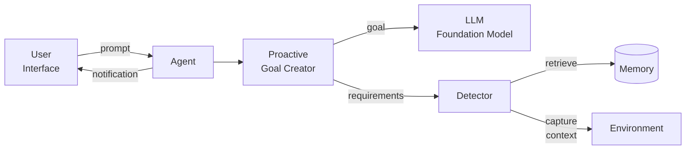

# Proactive Goal Creator

**Resumo**  
O *Proactive Goal Creator* antecipa os objetivos dos usuários analisando interações humanas e capturando proativamente contexto multimodal por meio de detectores apropriados, enriquecendo as descrições de objetivo e melhorando a acessibilidade. 2405.10467v4.pdf](file-service://file-KXAPTmJJtHAEXXJmGY3mtW)

```mermaid
flowchart LR
    U[User <br> Interface] -->|prompt| Dlg[Agent]
    Dlg -- notification --> U
    
        Dlg --> PGC[Proactive <br>Goal Creator]
        PGC -->|goal| PRE[LLM <br> Foundation Model]
        PGC -->|requirements| Det[Detector]
        Det -->|retrieve| Mem[(Memory)]
        
    
    Det -->|capture <br>context| Env[Environment]
```

## Contexto
Normalmente, os usuários expressam — por meio de um prompt ou diálogo — os objetivos que esperam que um agente alcance. Somente o diálogo, entretanto, pode fornecer contexto ambiental insuficiente. 2405.10467v4.pdf](file-service://file-KXAPTmJJtHAEXXJmGY3mtW)

## Problema
Quando um agente depende exclusivamente de conversação em texto/voz, o contexto que recebe pode ser incompleto ou ambíguo, levando à inferência imprecisa de objetivos e a um comportamento subótimo. 2405.10467v4.pdf](file-service://file-KXAPTmJJtHAEXXJmGY3mtW)

## Forças
* **Subespecificação** – (i) Usuários podem deixar de fornecer contexto completo ou especificar objetivos precisos; (ii) agentes conseguem recuperar apenas contexto limitado da memória. 2405.10467v4.pdf](file-service://file-KXAPTmJJtHAEXXJmGY3mtW)
* **Acessibilidade** – Usuários com determinadas deficiências podem não conseguir interagir de forma eficaz por meio de uma interface passiva e apenas em texto. 2405.10467v4.pdf](file-service://file-KXAPTmJJtHAEXXJmGY3mtW)

## Solução
Além do prompt e de qualquer contexto recuperado, o *Proactive Goal Creator* emite **requisitos** para detectores externos (por exemplo, câmeras, APIs de captura de tela, microfones, sensores). Esses detectores capturam o ambiente do usuário — gestos, layout de UI, localização etc. — e retornam dados multimodais que o componente analisa para inferir o objetivo **real**. O componente deve notificar proativamente os usuários quando a captura de contexto ocorrer e manter baixos os falsos positivos para evitar interrupções desnecessárias. As observações capturadas podem ser armazenadas na memória para construir *modelos de mundo* em evolução que aprimoram o raciocínio futuro (ver Figura 1).

## Consequências

### Benefícios
* **Interatividade** – O agente pode reagir a intenções latentes do usuário reveladas pelo contexto multimodal. 2405.10467v4.pdf](file-service://file-KXAPTmJJtHAEXXJmGY3mtW)
* **Precisão na busca por objetivos** – Entradas mais ricas aumentam a completude e a precisão dos objetivos. 2405.10467v4.pdf](file-service://file-KXAPTmJJtHAEXXJmGY3mtW)
* **Acessibilidade** – Modalidades alternativas de entrada dão suporte a usuários com deficiências visuais, motoras ou de fala. 2405.10467v4.pdf](file-service://file-KXAPTmJJtHAEXXJmGY3mtW)

### Desvantagens
* **Sobrecarga** – Coletar e processar dados multimodais introduz custos computacionais e de latência. 2405.10467v4.pdf](file-service://file-KXAPTmJJtHAEXXJmGY3mtW)
* **Comunicação** – Grandes cargas de contexto podem aumentar a largura de banda entre cliente e agente. 2405.10467v4.pdf](file-service://file-KXAPTmJJtHAEXXJmGY3mtW)

## Usos Conhecidos
* **GestureGPT** – Interpreta gestos de mão capturados por câmera para derivar intenções do usuário. ‡2405.10467v4.pdf](file-service://file-KXAPTmJJtHAEXXJmGY3mtW)
* **SeeHow** – Extrai etapas de codificação e trechos de código de screencasts de programação. ‡2405.10467v4.pdf](file-service://file-KXAPTmJJtHAEXXJmGY3mtW)
* **ProAgent** – Observa o comportamento de agentes colegas, deduz suas intenções e adapta planos de forma cooperativa. ‡2405.10467v4.pdf](file-service://file-KXAPTmJJtHAEXXJmGY3mtW)

## Padrões Relacionados
* **Passive Goal Creator** – Alternativa mais simples que depende apenas de diálogo e contexto recuperado. ‡2405.10467v4.pdf](file-service://file-KXAPTmJJtHAEXXJmGY3mtW)
* **Prompt/Response Optimiser** – Consome o objetivo e o contexto refinados produzidos por este padrão. ‡2405.10467v4.pdf](file-service://file-KXAPTmJJtHAEXXJmGY3mtW)
* **Multimodal Guardrails** – Inspeciona e filtra os dados multimodais capturados por este padrão. 2405.10467v4.pdf](file-service://file-KXAPTmJJtHAEXXJmGY3mtW)

## Referências
[23] Ha, D.; Schmidhuber, J. **World Models**, 2018.  
[24] LeCun, Y. **A Path towards Autonomous Machine Intelligence**, 2022.  
[25] Zeng, X. *et al.* **GestureGPT**, 2023.  
[26] Zhao, D. *et al.* **SeeHow**, 2023.  
[27] Zhang, C. *et al.* **ProAgent**, 2023. 2405.10467v4.pdf](file-service://file-KXAPTmJJtHAEXXJmGY3mtW)
