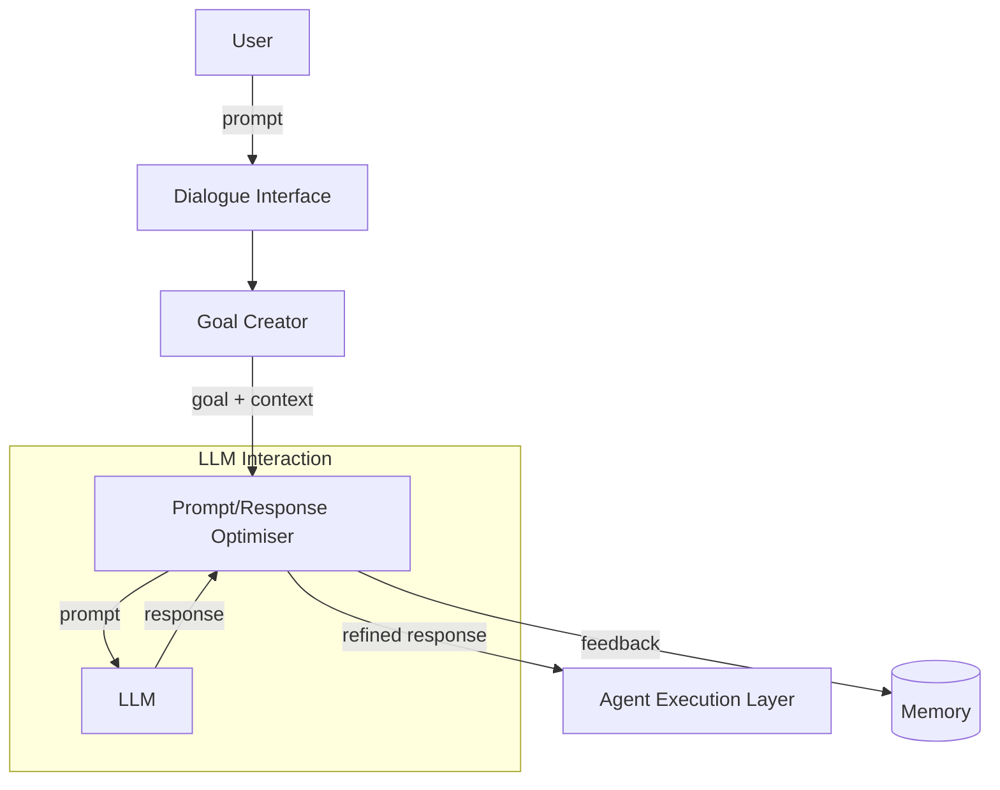

# Prompt/Response Optimiser

**Summary**  
The **Prompt/Response Optimiser** receives a generated goal and associated context and transforms them into optimized prompts for large language models (LLMs), improving output accuracy and ensuring responses align with the agent’s intended behavior.

## Context
After the agent receives or generates a goal with context (via a Goal Creator), it must translate this intent into effective prompts for an LLM, ensuring relevance, precision, and adherence to constraints and preferences.

## Problem
Poorly structured or overly generic prompts can result in ambiguous, inconsistent, or excessively verbose outputs, reducing the agent’s effectiveness and increasing user frustration.

## Forces
* **Natural language ambiguity** – Open-ended or vague expressions may lead to out-of-scope completions.
* **Behavioral control** – The agent may need to modulate style, tone, or detail level of responses.
* **Context window limitations** – It’s necessary to balance completeness with brevity.

## Solution
The **Prompt/Response Optimiser** applies prompt engineering techniques to enrich, rewrite, and validate the input before passing it to an LLM. It may also post-process the LLM’s output, applying summarization, alignment checks, or format adjustments. The optimizer operates using explicit parameters (e.g., temperature, max tokens, preferred format) and implicit context (e.g., memory, past goals, dialogue history).

## Consequences

### Benefits
* **Goal alignment** – Outputs are more consistent with the original user intent.
* **Controlled behavior** – Style, tone, and output format can be adjusted predictably.
* **Noise reduction** – Irrelevant or excessive content is minimized.

### Drawbacks
* **Computational overhead** – Optimisation may involve multiple LLM queries.
* **Bias risk** – Over-constraining the prompt may suppress creativity or nuance.

## Known Uses
* **Auto-GPT / AgentGPT** – Automatically re-prompt based on goal verification and self-evaluation.
* **Reflexion (Shinn et al.)** – Iteratively analyzes and reformulates prompts based on previous results.
* **Chain-of-Thought Prompting** – Uses explicit structure to guide step-by-step reasoning.

## Related Patterns
* **Proactive Goal Creator** – Supplies enriched goals and context that feed this component.
* **Memory Retriever** – Provides contextual data that the optimiser may inject into the prompt.
* **Tool Handler** – Influences how prompts are shaped when external tools are invoked.

## References
[31] Y. Shinn et al., “Reflexion: Language agents with verbal reinforcement learning,” 2023.  
[32] J. Wei et al., “Chain-of-Thought Prompting Elicits Reasoning in LLMs,” 2022.  
[3] T. B. Brown et al., “Language Models are Few-Shot Learners,” 2020.  