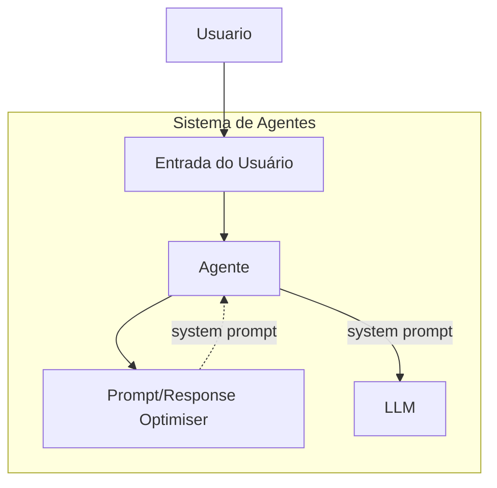

# Prompt/Response Optimiser

**Resumo**  
O **Prompt/Response Optimiser** recebe uma meta gerada e o contexto associado e os transforma em prompts otimizados para modelos de linguagem (LLMs), melhorando a precisão das saídas e garantindo que as respostas estejam alinhadas com o comportamento pretendido do agente.

```mermaid
flowchart TB
    Usuario
    subgraph Sistema de Agentes
        UI[Entrada do Usuário] --> AG[Agente]
        AG --> PGC[Prompt/Response Optimiser]
        PGC -.system prompt.-> AG 
        AG -->|system prompt| LLM[LLM]
    end
    Usuario --> UI
```

## Contexto
Após o agente receber ou gerar uma meta com contexto (via um Goal Creator), ele deve traduzir essa intenção em prompts eficazes para um LLM, garantindo relevância, precisão e adesão a restrições e preferências.

## Problema
Prompts mal estruturados ou excessivamente genéricos podem resultar em saídas ambíguas, inconsistentes ou excessivamente verbosas, reduzindo a eficácia do agente e aumentando a frustração do usuário.

## Forças
* **Ambiguidade da linguagem natural** – Expressões abertas ou vagas podem levar a conclusões fora do escopo.
* **Controle comportamental** – O agente pode precisar modular o estilo, o tom ou o nível de detalhe das respostas.
* **Limitações da janela de contexto** – É necessário equilibrar completude com concisão.

## Solução
O **Prompt/Response Optimiser** aplica técnicas de engenharia de prompts para enriquecer, reescrever e validar a entrada antes de passá-la a um LLM. Ele também pode pós-processar a saída do LLM, aplicando sumarização, verificações de alinhamento ou ajustes de formato. O otimizador opera usando parâmetros explícitos (por exemplo, temperatura, máximo de tokens, formato preferido) e contexto implícito (por exemplo, memória, metas anteriores, histórico de diálogo).

## Consequências

### Benefícios
* **Alinhamento com a meta** – As saídas ficam mais consistentes com a intenção original do usuário.
* **Comportamento controlado** – Estilo, tom e formato de saída podem ser ajustados de forma previsível.
* **Redução de ruído** – Conteúdo irrelevante ou excessivo é minimizado.

### Desvantagens
* **Sobrecarga computacional** – A otimização pode envolver múltiplas consultas ao LLM.
* **Risco de viés** – Constranger demais o prompt pode suprimir criatividade ou nuances.

## Usos Conhecidos
* **Auto-GPT / AgentGPT** – Re-prompt automático baseado em verificação de metas e autoavaliação.
* **Reflexion (Shinn et al.)** – Analisa e reformula prompts iterativamente com base em resultados anteriores.
* **Chain-of-Thought Prompting** – Usa estrutura explícita para orientar o raciocínio passo a passo.

## Padrões Relacionados
* **Proactive Goal Creator** – Fornece metas e contexto enriquecidos que alimentam este componente.
* **Memory Retriever** – Fornece dados contextuais que o otimizador pode injetar no prompt.
* **Tool Handler** – Influencia como os prompts são moldados quando ferramentas externas são invocadas.

## Referências
[31] Y. Shinn et al., “Reflexion: Language agents with verbal reinforcement learning,” 2023.  
[32] J. Wei et al., “Chain-of-Thought Prompting Elicits Reasoning in LLMs,” 2022.  
[3] T. B. Brown et al., “Language Models are Few-Shot Learners,” 2020.
