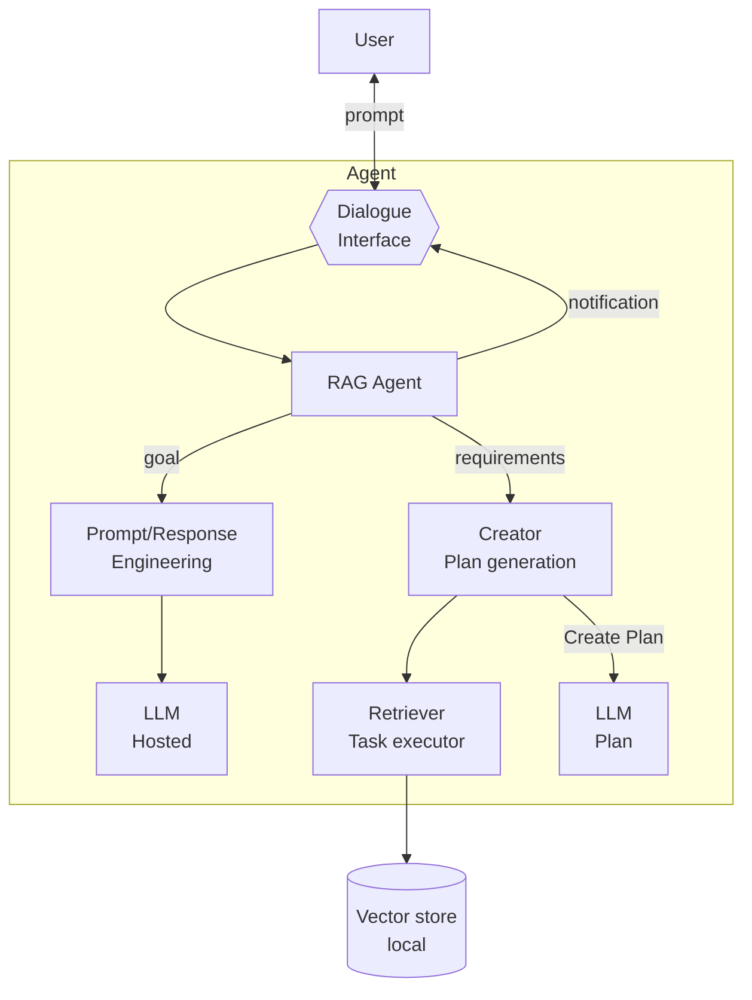

# Retrieval-Augmented Generation (RAG)

**Summary**  
The **Retrieval-Augmented Generation (RAG)** pattern enhances the agent’s knowledge by retrieving external data to augment language model responses, especially when foundation models lack domain-specific or up-to-date information. It allows agents to incorporate new, secure, or private knowledge at runtime without requiring fine-tuning.

## Context
Foundation models typically do not have access to domain-specific or private knowledge unless explicitly trained with it. This makes them less effective for specialized or sensitive tasks.

## Problem
How can agents reason over and generate responses using information that is **not embedded** in the model itself, without retraining or fine-tuning?

## Forces
- **Lack of knowledge** – Foundation models often miss specific, confidential, or newly available information.
- **Data privacy** – Internal data must not be used to train or fine-tune the base models.
- **Computational cost** – Training or adapting a model is expensive and impractical in many settings.

## Solution
The agent uses **external knowledge sources** (e.g., vector databases, document stores, APIs) to retrieve relevant information and inject it into the prompt or context before sending it to the LLM.

Typical implementation steps include:
1. Indexing documents as embeddings or structured knowledge.
2. Encoding the task/query into a vector.
3. Retrieving the top-k relevant items.
4. Injecting the retrieved content into the prompt for response generation.

This enables up-to-date, context-rich, and privacy-preserving generation without modifying the model itself.

## Consequences

### Benefits
- **Knowledge freshness** – Agents can reason over current or proprietary information.
- **Data privacy** – Local or private data is never exposed to model training.
- **Cost efficiency** – Avoids model retraining and reduces infrastructure burden.
- **Flexibility** – Easily adapts to different domains and evolving knowledge needs.

### Drawbacks
- **Maintenance overhead** – Requires infrastructure to store and update indexed knowledge.
- **Context window limitations** – Retrieved data must fit within the model's input size.
- **Dependency** – Relies on quality and availability of retrieval sources.

## Known Uses
- **LinkedIn** – Uses RAG to return relevant business case studies in user queries.
- **Corrective RAG (Yan et al.)** – Evaluates the trustworthiness of retrieved content.
- **Math Tutor (Levonian et al.)** – Injects textbook content into prompts to improve mathematical reasoning.

## Related Patterns
- **Prompt/Response Optimiser** – Integrates retrieved knowledge into prompt construction.
- **Memory Retriever** – May complement RAG by retrieving internal memory data.
- **Multimodal Guardrails** – Can validate retrieved content before it’s used in generation.
- **Agent Adapter** – Connects to APIs, search engines, or knowledge services for data access.

## References
[33] Yan et al., “Corrective Retrieval-Augmented Generation,” 2024.  
[34] Levonian et al., “Improving Math QA with RAG: Groundedness vs. Preference,” 2023.  
[30] Hu & Lu, “RAG and RAU: A Survey on Retrieval-Augmented LMs,” 2024.  
[31] Wang et al., “Federated RAG,” 2024.  
[32] Larson & Truitt, “GraphRAG: LLM discovery on narrative private data,” 2024.