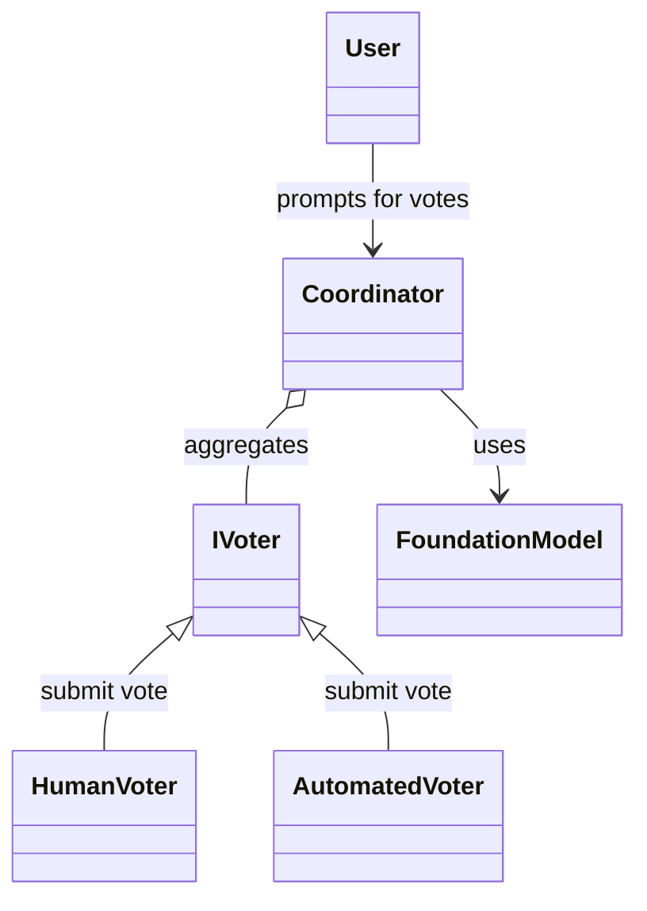

# VotingBasedCooperation Pattern

## Overview

The VotingBasedCooperation pattern enables multiple agents to independently estimate the complexity of user stories by voting. A coordinator agent collects, validates, and aggregates these votes, presenting the results in a clear and structured format without performing consensus or statistical analysis.

## Components

## Class Diagram

- **Coordinator**: Aggregates and validates votes, formats the output.
- **Voters**: Agents (human or automated) that provide votes with justifications.
- **Foundation Model (LLM)**: Assists the coordinator in processing and formatting the aggregated votes.

## Workflow

1. Each voter submits a vote for a user story, including:
    - agent\_id
    - user\_story\_id
    - story\_point (must be one of: 1, 2, 3, 5, 8, 13)
    - justification
2. The coordinator collects all votes, validates them, and generates a Markdown summary.
3. No consensus or averaging is performed; only individual votes are reported.

## Output

The coordinator outputs a Markdown table or list with the following columns:
- Agent ID
- User Story ID
- Story Point
- Justification

## Restrictions

- No statistical analysis or consensus computation.
- No modification or interpretation of agent responses.
- Only validated votes are reported.

## Integration

- Implement a voter interface for each agent.
- Provide a compatible foundation model for LLM operations.
- Use the coordinator to aggregate and report votes.