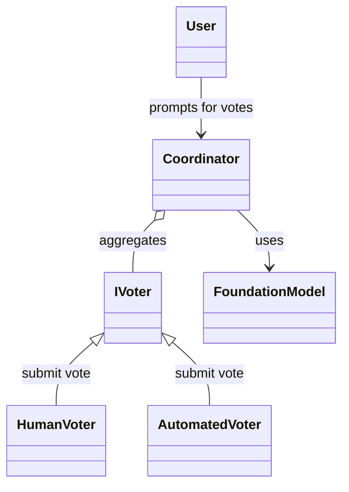
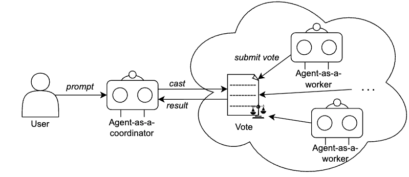

# VotingBasedCooperation Pattern

## Visão Geral

O padrão VotingBasedCooperation permite que vários agentes estimem de forma independente a complexidade de user stories por meio de votos. Um agente coordenador coleta, valida e agrega esses votos, apresentando os resultados de forma clara e estruturada, sem realizar consenso ou análise estatística.

## Componentes

## Diagrama de Classes

- **Coordinator**: Agrega e valida votos, formata a saída.
- **Voters**: Agentes (humanos ou automatizados) que fornecem votos com justificativas.
- **Foundation Model (LLM)**: Auxilia o coordenador no processamento e formatação dos votos agregados.

## Fluxo de Trabalho

1. Cada votante envia um voto para uma user story, incluindo:
    - agent_id
    - user_story_id
    - story_point (deve ser um dos: 1, 2, 3, 5, 8, 13)
    - justification
2. O coordenador coleta todos os votos, valida-os e gera um resumo em Markdown.
3. Não é realizado consenso ou média; apenas votos individuais são reportados.

## Saída

O coordenador produz uma tabela ou lista em Markdown com as seguintes colunas:
- Agent ID
- User Story ID
- Story Point
- Justification

## Restrições

- Sem análise estatística ou cálculo de consenso.
- Sem modificação ou interpretação das respostas dos agentes.
- Apenas votos validados são reportados.

## Integração

- Implementar uma interface de votante para cada agente.
- Fornecer um modelo de fundação compatível para operações de LLM.
- Usar o coordenador para agregar e reportar votos.
