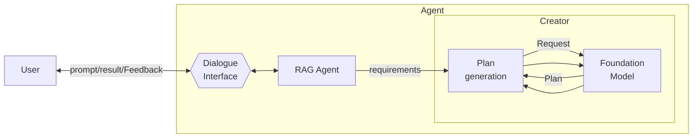

# Incremental Model Querying

**Resumo**  
O padrão **Incremental Model Querying** descreve um processo em que o agente interage com o modelo fundacional de forma iterativa, realizando múltiplas consultas durante a geração de um plano. A cada passo, o modelo é consultado novamente, permitindo refinamento incremental, injeção de contexto adicional e maior explicabilidade.

## Contexto
Quando um usuário fornece um objetivo ao agente, o modelo pode ter dificuldades para gerar um plano adequado com uma única chamada. O raciocínio pode exigir vários passos intermediários, que não cabem ou não são capturados por um único prompt.

## Problema
Como o agente pode realizar um processo de raciocínio preciso e explicável, mesmo que o modelo não consiga produzir um plano completo em uma única tentativa?

## Forças
- **Janela de contexto limitada** – A limitação de tokens pode impedir prompts completos.
- **Oversimplificação** – Uma única consulta pode não capturar todos os requisitos da tarefa.
- **Explicabilidade** – Usuários e agentes precisam compreender e confiar nos passos intermediários.

## Solução
O agente conduz um processo de raciocínio passo a passo, com múltiplas consultas ao modelo fundacional. A cada passo, novos dados, feedbacks ou observações podem ser injetados. Esse ciclo iterativo permite construir planos mais detalhados, revisar decisões anteriores e capturar preferências do usuário. O número de etapas pode ser pré-definido ou controlado dinamicamente.

## Consequências

### Benefícios
- **Contexto suplementar** – Permite dividir a tarefa em partes menores e injetar contexto incrementalmente.
- **Certeza no raciocínio** – Permite validação e refinamento iterativo dos passos.
- **Explicabilidade** – Cada resposta pode incluir justificativas claras para as decisões do plano.

### Desvantagens
- **Overhead** – Mais interações implicam maior tempo de resposta e custo computacional.
- **Custo** – Pode tornar-se caro quando usado com APIs comerciais de modelos fundacionais.

## Exemplos de uso conhecidos
- **HuggingGPT** – Decompõe tarefas em subtarefas interdependentes por meio de múltiplas consultas ao modelo.
- **EcoAssistant** – Interage com o modelo para refinar código em ciclos sucessivos.
- **ReWOO** – Gera planos com dependências e os ajusta conforme evidências externas.

## Padrões relacionados
- **One-Shot Model Querying** – Alternativa direta com apenas uma chamada ao modelo.
- **Multi-Path Plan Generator** – Pode construir planos com múltiplas ramificações com base em consultas iterativas.
- **Self-Reflection** – Usa múltiplas interações para revisar e avaliar respostas.
- **Human-Reflection** – Permite iteração entre agente e usuário durante a construção do plano.
- **Multimodal Guardrails** – Pode validar entradas e saídas em cada iteração do modelo.

## Referências
[37] Shen et al., “HuggingGPT,” 2023.  
[38] Li et al., “EcoAssistant,” 2023.  
[39] Xu et al., “ReWOO: Reasoning with Workflow and Observation,” 2023.