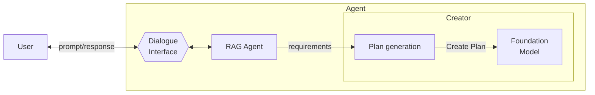

# One-Shot Model Querying

**Resumo**  
O padrão **One-Shot Model Querying** define um modelo de interação em que o agente consulta o modelo fundacional (LLM) **uma única vez** para gerar um plano completo a partir da entrada do usuário. Essa abordagem visa maximizar eficiência e simplicidade, sendo indicada quando a tarefa pode ser resolvida em uma única rodada de raciocínio.

## Contexto
Ao interagir com agentes para realizar tarefas, usuários muitas vezes fornecem um objetivo direto. Para gerar um plano de ação a partir desse objetivo, o agente pode recorrer a um LLM. Quando a tarefa é simples, direta e sem ambiguidade, é possível realizar essa consulta de forma única, sem iterações.

## Problema
Como o agente pode gerar, de forma eficiente e econômica, um plano a partir da intenção do usuário, evitando múltiplas interações com o modelo?

## Forças
- **Eficiência** – Algumas tarefas exigem respostas rápidas.
- **Custo** – Chamadas a modelos comerciais têm custo associado.
- **Simetria de contexto** – Em casos simples, todo o contexto pode ser representado no prompt inicial.

## Solução
O agente estrutura um prompt com base no objetivo do usuário e o envia **uma única vez** ao modelo de linguagem. O modelo retorna um plano de ação completo, sem exigir verificações ou refinamentos adicionais. Isso permite resolver rapidamente tarefas que não exigem raciocínio iterativo nem recuperação externa de conhecimento.

## Consequências

### Benefícios
- **Alto desempenho** – Geração de plano em tempo constante.
- **Redução de custo** – Apenas uma chamada ao modelo é realizada.
- **Simplicidade arquitetural** – Sem necessidade de retrievers, memória ou verificações.

### Desvantagens
- **Oversimplificação** – Tarefas complexas podem ser mal resolvidas.
- **Baixa explicabilidade** – A falta de raciocínio passo a passo limita a transparência.
- **Limite de contexto** – Restrições na janela de tokens podem comprometer a completude do plano.

## Exemplos de uso conhecidos
- **Geração de plano em uma etapa única** com base em metas declaradas.
- **Zero-shot e Chain-of-Thought prompting** que produzem respostas complexas a partir de um único prompt.
- **Assistentes rápidos** para brainstorming, sumarização ou planejamento direto.

## Padrões relacionados
- **Incremental Model Querying** – Alternativa iterativa que permite verificação e refinamento.
- **Single-Path Plan Generator** – Geração de planos lineares com uma única resposta.
- **Multimodal Guardrails** – Pode monitorar ou validar a entrada/saída da única consulta ao modelo.

## Referências
[35] Kojima et al., “Large Language Models are Zero-Shot Reasoners,” 2022.  
[36] Wei et al., “Chain-of-Thought Prompting Elicits Reasoning in LLMs,” 2022.  
[13] LinkedIn Engineering, “Musings on Building a Generative AI Product,” 2023.