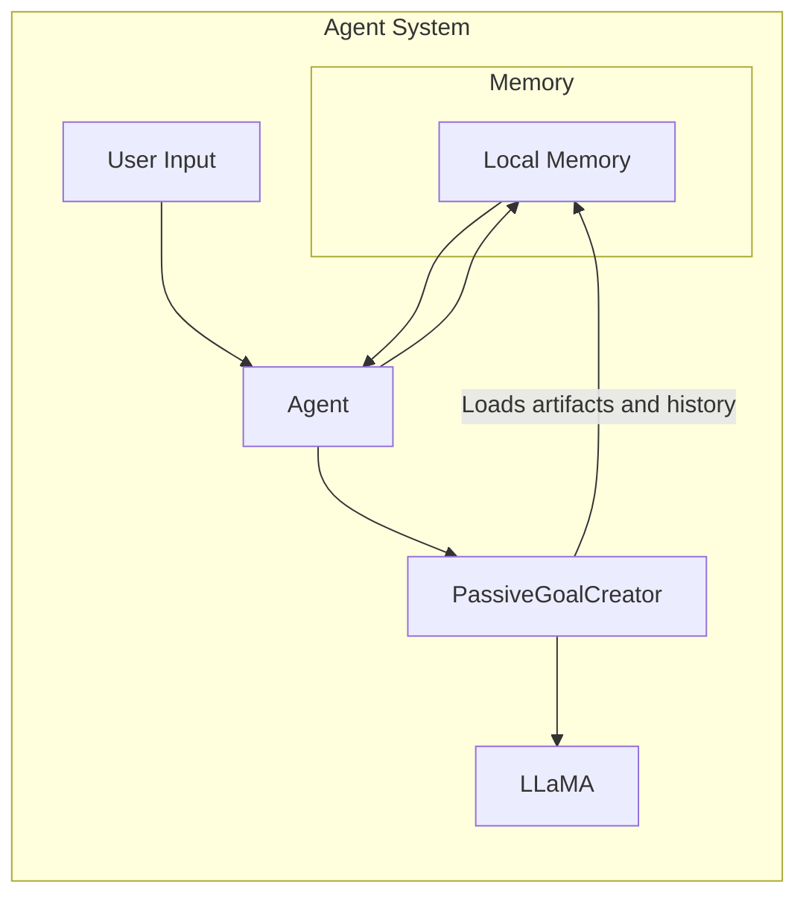

## Passive Goal Creator

### Resumo
O **Passive Goal Creator** analisa os objetivos articulados pelos usuários por meio da interface de diálogo.

### Contexto
Ao interagir com agentes para resolver determinados problemas, os usuários fornecem contexto relacionado e explicam seus objetivos por meio de prompts.

### Problema
Usuários podem não ter experiência em interações com agentes, e as informações fornecidas podem ser ambíguas para que os agentes alcancem os objetivos desejados.

### Forças
- **Subespecificação**: Os usuários podem não fornecer contexto completo ou objetivos bem definidos.
- **Eficiência**: Espera-se que os agentes forneçam respostas rapidamente.

### Solução
O agente baseado em modelo fundacional oferece uma interface de diálogo pela qual os usuários especificam diretamente o contexto e os problemas. Essas informações são encaminhadas ao *Passive Goal Creator*, que determina os objetivos.

Além disso, o *Passive Goal Creator* pode recuperar informações adicionais da memória do agente, incluindo:
- Repositórios de artefatos;
- Ferramentas utilizadas recentemente;
- Histórico de conversas;
- Exemplos positivos e negativos.

Essas informações são adicionadas ao prompt para auxiliar na definição do objetivo. Os objetivos gerados são então enviados a outros componentes para decomposição e execução de tarefas.

Nos sistemas multiagente, um agente pode invocar a API de outro agente para delegar uma tarefa. O agente receptor analisará as informações recebidas para determinar o objetivo correspondente.

### Consequências

#### Benefícios
- **Interatividade**: Usuários e agentes podem interagir diretamente via interface de diálogo ou APIs.
- **Busca de objetivos**: O agente pode analisar o contexto e recuperar dados da memória para identificar e planejar a realização dos objetivos.
- **Eficiência**: A interface de diálogo facilita o uso direto e intuitivo pelo usuário.

#### Desvantagens
- **Incerteza de raciocínio**: Contextos ambíguos e ausência de padrões formais de prompt podem intensificar as incertezas no processo de raciocínio.

### Exemplos de uso conhecidos
- **Liu et al. (2024)**: Agente que ajuda a refinar perguntas de pesquisa via interface de diálogo.
- **Kannan et al. (2022)**: Agente que permite decompor e atribuir tarefas a robôs.
- **HuggingGPT**: Interpreta pedidos complexos como objetivos por meio de chatbot.

### Padrões relacionados
- **Proactive Goal Creator**: Alternativa ao padrão passivo, permitindo injeção de contexto multimodal.
- **Prompt/Response Optimiser**: Pode refinar os objetivos e contexto recebidos do *Passive Goal Creator*.