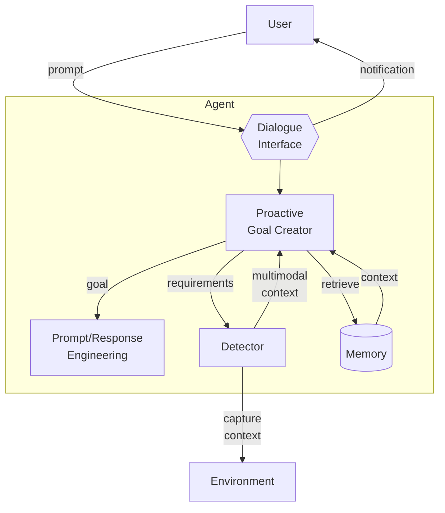

# Proactive Goal Creator

**Resumo**  
O **Proactive Goal Creator** antecipa os objetivos dos usuários entendendo suas interações e capturando contexto multimodal por meio de ferramentas adequadas, aumentando interatividade, precisão na busca de objetivos e acessibilidade.

_Figura 1. Proactive Goal Creator._

## Contexto
Usuários descrevem, via prompt, o que esperam que o agente alcance. Entretanto, somente o diálogo pode não fornecer informações de contexto suficientes.

## Problema
Informações limitadas coletadas exclusivamente pela interface de diálogo podem levar a respostas imprecisas, pois nem sempre capturam totalmente a intenção e o ambiente do usuário.

## Forças
* **Sub‑especificação** – (i) Usuários podem não explicar todo o contexto nem especificar objetivos precisos; (ii) o agente acessa apenas um subconjunto de informações em memória.
* **Acessibilidade** – Usuários com certas deficiências podem não conseguir interagir apenas por texto/voz.

## Solução
Além dos prompts e do contexto recuperado da memória, o Proactive Goal Creator envia *requisitos* a detectores (sensores, câmeras, leitura de tela, etc.) que capturam o ambiente do usuário (gestos, layout de UI, áudio, localização, entre outros). Esses dados multimodais são analisados para inferir o objetivo real antes de passá‑lo às etapas seguintes do agente. O componente deve notificar o usuário sobre a captura de contexto, minimizando falsos positivos, e pode armazenar as observações na memória para formação de *world‑models* contínuos.  

Consequências
-------------

### Benefícios
* **Interatividade** – O agente interage proativamente, antecipando decisões dos usuários a partir de sinais multimodais.
* **Goal‑seeking** – Entradas multimodais oferecem contexto mais rico, aumentando precisão e completude do objetivo.
* **Acessibilidade** – Ferramentas adicionais capturam intenções de usuários com limitações motoras, visuais ou de fala.

### Desvantagens
* **Overhead** – Captura e processamento multimodal geram custos adicionais.
* **Comunicação** – Contexto multimodal pode aumentar tráfego e latência entre usuário e agente.

## Exemplos de uso conhecidos
* **GestureGPT** – Interpreta gestos manuais via câmera para compreender intenções de controle.
* **SeeHow (Zhao et al.)** – Analisa screencasts de programação para extrair passos e trechos de código.
* **ProAgent** – Observa o comportamento de agentes colegas, deduz suas intenções e ajusta o planejamento colaborativamente.

## Padrões relacionados
* **Passive Goal Creator** – Alternativa sem captura multimodal, mais simples e eficiente.
* **Prompt/Response Optimiser** – Recebe o objetivo e o contexto refinados para gerar prompts otimizados.
* **Multimodal Guardrails** – Auxiliam no filtro/controle dos dados multimodais capturados.

Referências  
[25] X. Zeng et al., “GestureGPT: Zero‑shot interactive gesture understanding …”, 2023.  
[26] D. Zhao et al., “SeeHow: Workflow extraction from programming screencasts …”, 2023.  
[27] C. Zhang et al., “ProAgent: Building proactive cooperative AI with LLMs”, 2023.  
[23] D. Ha & J. Schmidhuber, “World Models”, 2018.  
[24] Y. LeCun, “A path towards autonomous machine intelligence”, 2022.