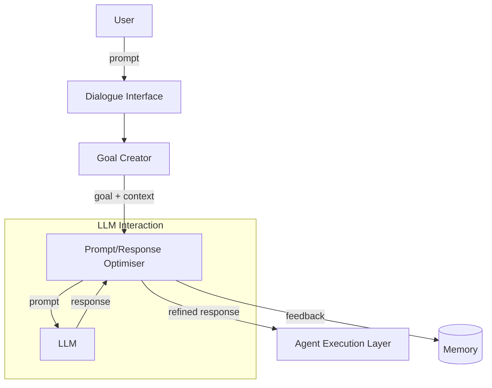

# Prompt/Response Optimiser

**Resumo**   
O **Prompt/Response Optimiser** recebe um objetivo gerado e um contexto associado e os transforma em entradas otimizadas para grandes modelos de linguagem (LLMs), melhorando a precisão das respostas e promovendo coerência com o comportamento desejado.

## Contexto 
Após o agente gerar ou receber um objetivo com seu contexto (via Goal Creator), ele precisa transformar essa intenção em prompts eficientes para um LLM, garantindo que a resposta esteja alinhada com o objetivo do agente e com suas limitações e preferências.

## Problema 
Prompts mal formulados ou genéricos podem produzir saídas ambíguas, inconsistentes ou excessivamente longas, prejudicando a efetividade do agente.

## Forças
* **Ambiguidade de linguagem natural** – Expressões abertas ou vagas podem levar a respostas fora de escopo.
* **Controle de comportamento** – O agente pode precisar modular o estilo da resposta (ex: resumida, formal, visual).
* **Limitações de janelas contextuais** – É preciso balancear completude com concisão.

## Solução 
O componente **Prompt/Response Optimiser** aplica técnicas de engenharia de prompt, enriquecendo, ajustando e validando a entrada antes de enviá-la ao LLM. Ele também pode aplicar pós-processamento na resposta retornada, como sumarização, verificação de alinhamento com o objetivo, ou simplificação da linguagem. O comportamento é ajustado via parâmetros explícitos (ex: temperatura, número de passos, formato preferido) e contexto implícito (ex: histórico do usuário, objetivos anteriores).

# Consequências

### Benefícios
* **Melhor alinhamento** – As respostas são mais relevantes ao objetivo original.
* **Comportamento controlável** – Permite ajustar o tom, formato e escopo das respostas.
* **Redução de ruído** – Minimiza excesso de conteúdo irrelevante ou repetitivo.

### Desvantagens
* **Custo adicional** – A etapa de otimização pode incluir múltiplas chamadas ao modelo.
* **Risco de viés** – Um prompt excessivamente restritivo pode eliminar criatividade ou nuance.

Exemplos de uso conhecidos
* **Auto-GPT / AgentGPT** – Aplicam re-prompting automático com verificação de objetivo e reescrita de instruções.
* **Reflexion (Shinn et al.)** – Realiza análise iterativa das respostas geradas e reescreve os prompts com base no histórico.
* **Chain-of-Thought Prompting** – Usa estruturas explícitas para guiar o raciocínio do LLM.

Padrões relacionados
* **Proactive Goal Creator** – Gera objetivos ricos que alimentam este componente.
* **Memory Retriever** – Fornece contexto adicional que o Optimiser pode embutir no prompt.
* **Tool Handler** – Pode influenciar o formato do prompt para ativar ferramentas específicas.

Referências  
[31] Y. Shinn et al., “Reflexion: Language agents with verbal reinforcement learning,” 2023.  
[32] J. Wei et al., “Chain-of-Thought Prompting Elicits Reasoning in LLMs,” 2022.  
[3] T. B. Brown et al., “Language Models are Few-Shot Learners,” 2020.  