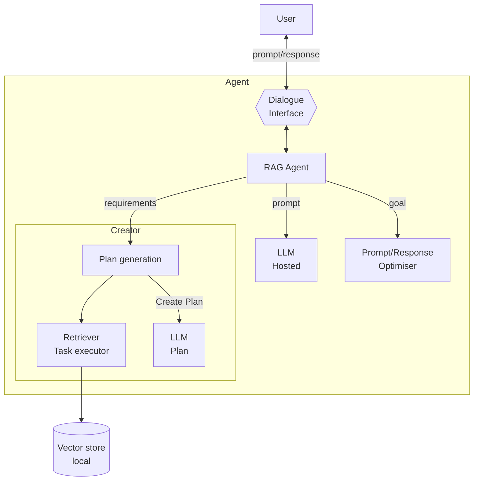

# Retrieval-Augmented Generation (RAG)

**Resumo**  
O padrão **Retrieval-Augmented Generation (RAG)** complementa o conhecimento de agentes baseados em foundation models com dados externos, mantendo a privacidade e melhorando a atualidade das respostas. Em vez de depender apenas de conhecimento embutido no modelo, o agente consulta fontes externas (como vetores ou bases documentais) para enriquecer a geração de respostas.

## Contexto
Modelos de linguagem fundacional geralmente não têm acesso a conhecimento especializado ou dados locais confidenciais, a menos que sejam especificamente ajustados para isso. Isso limita sua precisão em tarefas específicas.

## Problema
Como permitir que agentes gerem respostas com base em informações que **não estão presentes** no modelo base, sem a necessidade de re-treinamento ou fine-tuning?

## Forças
- **Falta de conhecimento** – O modelo pode não ter aprendido informações específicas de domínio ou atualizadas.
- **Privacidade dos dados** – É inaceitável ou impossível treinar o modelo com dados sensíveis ou internos.
- **Custo computacional** – Treinar ou ajustar um modelo com novos dados pode ser caro e inviável.

## Solução
O agente consulta uma fonte de conhecimento externa — como uma **vector store**, banco de dados ou API — para recuperar informações relevantes sobre a tarefa atual. Essas informações são integradas ao prompt enviado ao LLM, criando um ciclo de geração **aumentado por recuperação**.

A implementação típica envolve:
1. Indexação dos dados (texto, código, etc.) em forma de embeddings ou grafos.
2. Codificação da consulta/tarefa pelo agente.
3. Busca dos dados mais relevantes.
4. Integração da informação recuperada com o prompt para resposta final.

Essa abordagem não requer ajuste do modelo e permite atualização dinâmica do conhecimento.

## Consequências

### Benefícios
- **Atualização do conhecimento** – O agente pode acessar dados recentes ou específicos sem modificar o modelo.
- **Privacidade** – Dados sensíveis permanecem locais e fora do modelo.
- **Eficiência de custo** – Evita o custo de fine-tuning ou re-treinamento.
- **Flexibilidade** – Permite adaptar o agente a novos domínios com baixo overhead.

### Desvantagens
- **Sobrecarga de manutenção** – Bases vetoriais e fontes externas precisam ser mantidas e atualizadas.
- **Limitações contextuais** – O tamanho da janela de contexto do modelo pode restringir o uso de dados recuperados.
- **Dependência externa** – A confiabilidade do agente depende da qualidade e disponibilidade das fontes de recuperação.

## Exemplos de uso conhecidos
- **LinkedIn** – Emprega RAG para responder com estudos de caso relevantes e atualizados.
- **Corrective RAG (Yan et al.)** – Realiza avaliação de qualidade das respostas com base na confiança da recuperação.
- **Math Tutor com RAG (Levonian et al.)** – Integra conteúdo de livros abertos de matemática para tutor inteligente.

## Padrões relacionados
- **Prompt/Response Optimiser** – Integra os dados recuperados no prompt final.
- **Memory Retriever** – Pode funcionar em conjunto com RAG para buscar dados internos.
- **Multimodal Guardrails** – Pode validar os dados recuperados antes da geração.
- **Agent Adapter** – Usado para conectar com fontes de dados específicas (APIs, bancos de dados locais).

## Referências
[33] Yan et al., “Corrective Retrieval-Augmented Generation,” 2024.  
[34] Levonian et al., “Improving Math QA with RAG: Groundedness vs. Preference,” 2023.  
[30] Hu & Lu, “RAG and RAU: A Survey on Retrieval-Augmented LMs,” 2024.  
[31] Wang et al., “Federated RAG,” 2024.  
[32] Larson & Truitt, “GraphRAG: LLM discovery on narrative private data,” 2024.